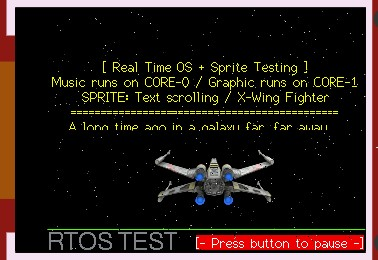

# ESP32_FreeRTOS_Test
Test ESP32 multi-tasking runs on Core 0 and Core 1 simultaneously.
ESP32 test run sketch on 2 Cores separately
- Core 0 Animation
- Core 1 Nes Music Emulator
  
[Youtube](https://youtu.be/w-QqZ7T1ar8)

this project use add-on library from
https://github.com/connornishijima/Cartridge
https://github.com/Bodmer/TFT_eSPI
